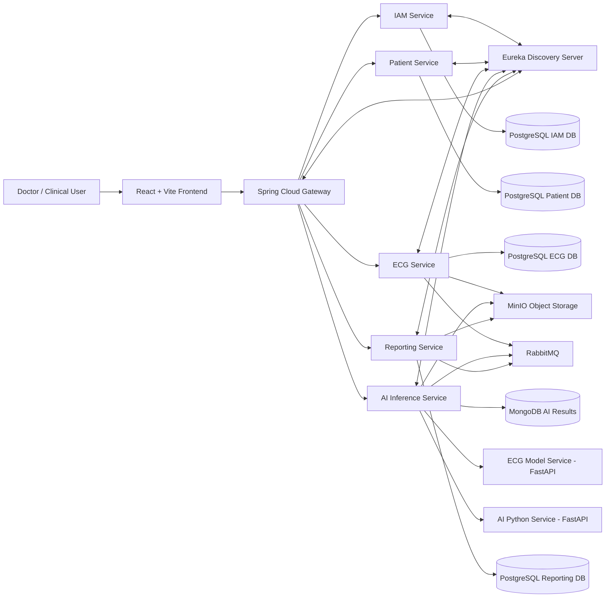

# HeartSync

## Introduction

HeartSync is a distributed cardiovascular clinical application designed to support doctors during cardiac investigation workflows. The system manages patient records, ECG uploads, coronary angiogram uploads, AI-assisted analysis, and cardiac assessment report generation.

The main goal of the application is to provide a single clinical workflow where a doctor can register patients, upload diagnostic files, receive AI-supported findings, and generate a structured PDF report for later review or sharing.

Core functionalities include:

- Doctor registration, login, and JWT-based authentication.
- Patient registry with demographic and contact information.
- ECG upload and AI-assisted ECG analysis.
- Coronary angiogram upload with stenosis detection, segmentation, and QCA-style measurements.
- Event-driven AI orchestration through RabbitMQ.
- Clinical PDF report generation and download.
- Service discovery, gateway routing, and database-per-service isolation.

## Architecture

HeartSync follows a microservices architecture. The React frontend communicates with a single API Gateway. The gateway validates requests and routes traffic to backend services registered in Eureka. Each service owns its own database or storage responsibility, while RabbitMQ is used for asynchronous AI and reporting workflows.

### Architectural Diagram



### Design Decisions

The application is split into multiple services to keep each business area independently deployable, testable, and maintainable.

- **IAM Service** owns authentication and user identity. This avoids duplicating login and token logic across clinical services.
- **Patient Service** owns patient demographics and clinical registration data. Other services reference patients by patient ID instead of storing full patient records.
- **ECG Service** owns ECG uploads and ECG metadata. It stores files in MinIO and publishes AI analysis requests through RabbitMQ.
- **AI Inference Service** acts as the AI orchestration layer. It consumes analysis events, routes ECG and angiogram requests to the correct AI workflow, stores results, and publishes completed events.
- **Reporting Service** owns report generation, report metadata, PDF storage, and report download.
- **API Gateway** provides one secure entry point for the frontend and prevents the UI from calling internal services directly.
- **Eureka Discovery Server** removes hardcoded service locations by allowing services to register themselves and allowing the gateway to route using logical service names.
- **RabbitMQ** decouples uploads from AI execution so long-running analysis does not block user requests.
- **MinIO** centralizes binary object storage for ECG files, angiogram images, segmentation outputs, and report PDFs.

## Microservices

### Implementation Methods

The backend is implemented using Spring Boot microservices and the Netflix/Spring Cloud ecosystem:

- **Netflix Eureka Server** for service discovery.
- **Eureka Client** in each Spring Boot service for registration and heartbeat monitoring.
- **Spring Cloud Gateway** for routing, JWT checks, CORS, and load-balanced service calls.
- **Spring Cloud LoadBalancer** with `lb://service-name` routes instead of hardcoded service URLs.
- **Spring Web / REST Controllers** for service APIs.
- **Spring Data JPA** with PostgreSQL for relational service data.
- **Spring Data MongoDB** for flexible AI analysis documents.
- **RabbitMQ** for event-driven communication between ECG, AI, and reporting services.
- **FastAPI** for Python-based AI model services.
- **Docker Compose** for local infrastructure and service orchestration.

### Core Services

#### IAM Service

The IAM Service handles user registration, login, JWT generation, and user lookup. It stores user credentials and clinical role data in PostgreSQL.

REST endpoints:

| Method | Endpoint | Description |
| --- | --- | --- |
| `POST` | `/api/auth/register` | Register a doctor, nurse, or admin user |
| `POST` | `/api/auth/login` | Authenticate a user and return a JWT |
| `GET` | `/api/auth/me` | Return the authenticated user context forwarded by the gateway |
| `GET` | `/api/internal/users/{id}` | Internal lookup used by other services to resolve user details |
| `GET` | `/actuator/health` | Health check endpoint |

Inter-service interactions:

- The API Gateway validates JWT tokens created by the IAM Service.
- Other services receive `X-User-Id`, `X-User-Role`, and `X-User-Email` headers from the gateway.
- Reporting can use the internal user lookup to display the correct referring physician or generated-by user.

#### Patient Service

The Patient Service manages patient records, demographics, contact details, consent, and referring physician information. It stores patient data in a dedicated PostgreSQL database.

REST endpoints:

| Method | Endpoint | Description |
| --- | --- | --- |
| `POST` | `/api/patients` | Create a new patient record |
| `GET` | `/api/patients` | List all patients or search by name |
| `GET` | `/api/patients/{id}` | Get one patient by ID |
| `PUT` | `/api/patients/{id}` | Update patient information |
| `DELETE` | `/api/patients/{id}` | Delete a patient record |

Inter-service interactions:

- ECG, AI, and Reporting use patient IDs to connect diagnostic files and reports to a patient.
- The gateway injects the authenticated user ID when a patient record is created.
- Reports combine patient data with AI and ECG findings.

#### ECG Service

The ECG Service manages ECG file uploads and ECG metadata. It stores ECG files in MinIO, stores ECG records in PostgreSQL, and publishes AI request events through RabbitMQ.

REST endpoints:

| Method | Endpoint | Description |
| --- | --- | --- |
| `POST` | `/api/ecg/upload` | Upload an ECG file for a patient |
| `GET` | `/api/ecg/{id}` | Get one ECG record by ID |
| `GET` | `/api/ecg/patient/{patientId}` | List ECG records for a patient |
| `DELETE` | `/api/ecg/{id}` | Delete an ECG record |
| `GET` | `/actuator/health` | Health check endpoint |

Inter-service interactions:

- Stores uploaded ECG files in MinIO.
- Publishes `AiAnalysisRequestedEvent` messages to RabbitMQ.
- The AI Inference Service consumes these messages and performs ECG analysis.
- Reporting later uses ECG results when generating the cardiac assessment PDF.

#### AI Inference Service

The AI Inference Service is the orchestration service for AI analysis. It handles angiogram analysis requests, consumes ECG and angiogram analysis events, calls Python AI services, stores AI results in MongoDB, and publishes completion events.

REST endpoints:

| Method | Endpoint | Description |
| --- | --- | --- |
| `POST` | `/api/ai/angiogram/analyze` | Upload an angiogram and request analysis |
| `GET` | `/api/ai/angiogram/patient/{patientId}` | Get the latest angiogram result for a patient |
| `GET` | `/api/ai/results/{id}` | Get an AI result by result ID |
| `GET` | `/api/ai/results/ecg/{ecgRecordId}` | Get AI result for a specific ECG record |
| `GET` | `/api/ai/results/patient/{patientId}` | List all AI results for a patient |

Inter-service interactions:

- Consumes `AiAnalysisRequestedEvent` from RabbitMQ.
- Routes ECG events to the ECG Model Service.
- Routes angiogram events to the AI Python Service for segmentation and QCA processing.
- Reads uploaded files from MinIO when needed.
- Stores analysis results in MongoDB.
- Publishes AI completed events for reporting workflows.

#### Reporting Service

The Reporting Service generates cardiac assessment PDF reports using patient details, ECG findings, angiogram findings, and AI analysis results. It stores report metadata in PostgreSQL and stores generated PDFs in MinIO.

REST endpoints:

| Method | Endpoint | Description |
| --- | --- | --- |
| `POST` | `/api/reports/generate` | Generate a new cardiac assessment report |
| `GET` | `/api/reports/{id}` | Get report metadata by ID |
| `GET` | `/api/reports/patient/{patientId}` | List reports for a patient |
| `GET` | `/api/reports/{id}/download` | Download the generated report PDF |
| `DELETE` | `/api/reports/{id}` | Delete a report |

Inter-service interactions:

- Consumes completed AI events from RabbitMQ.
- Uses patient, ECG, and AI result data to build report content.
- Stores generated report PDFs in MinIO.
- Provides PDF download endpoints to the frontend.

#### Supporting AI Services

| Service | Technology | Endpoints | Purpose |
| --- | --- | --- | --- |
| ECG Model Service | FastAPI / Python | `GET /health`, `POST /predict` | Classifies uploaded ECG images |
| AI Python Service | FastAPI / Python | `GET /health` and internal analysis routes | Performs angiogram segmentation and QCA-related processing |

### Discovery Server

The system uses Eureka Server as the discovery registry. Each Spring Boot service is configured as a Eureka client and registers itself using its `spring.application.name`, such as `patient-service`, `ecg-service`, and `ai-inference-service`.

The discovery server monitors service availability using heartbeats. Services renew their leases at regular intervals. In the local development configuration, stale instances are evicted quickly so the Eureka dashboard reflects service failures during demos and testing.

Important configuration decisions:

- Eureka Server runs on port `8761`.
- Services register through `EUREKA_SERVER_URL`.
- `prefer-ip-address: true` is enabled for service instances.
- The gateway fetches the registry frequently so newly started services become routable quickly.
- Actuator health endpoints are exposed for service health checks.

### API Gateway

The API Gateway is implemented with Spring Cloud Gateway and runs as the single backend entry point for the frontend.

Gateway responsibilities:

- Route `/api/auth/**` to `iam-service`.
- Route `/api/patients/**` to `patient-service`.
- Route `/api/ecg/**` to `ecg-service`.
- Route `/api/ai/**` to `ai-inference-service`.
- Route `/api/reports/**` to `reporting-service`.
- Validate JWT tokens for protected routes.
- Forward authenticated user context through headers.
- Apply CORS settings for the React frontend.
- Use `lb://service-name` URIs so routes are resolved through Eureka.
- Expose actuator gateway diagnostics for debugging.

## Event Flow

HeartSync uses a unified AI analysis request flow:

1. A doctor uploads an ECG or coronary angiogram from the frontend.
2. The service saves the file and metadata.
3. An `AiAnalysisRequestedEvent` is published to RabbitMQ.
4. The AI Inference Service consumes the event.
5. The AI Inference Service routes the request by analysis type:
   - ECG requests go to the ECG model workflow.
   - Angiogram requests go to segmentation and QCA workflows.
6. AI results are stored and published as completed result events.
7. Reporting uses completed findings to generate clinical PDF reports.

The event contract includes request ID, idempotency key, event version, timestamps, and trace information to support retries, observability, and safer processing.

## User Interface

### Implementation Details

The frontend is implemented with:

- **React** for component-based UI development.
- **Vite** for fast development builds.
- **React Router** for page navigation.
- **Axios** for API calls through the gateway.
- **Tailwind CSS** for responsive styling.

Main UI workflows:

- Register and sign in as a clinical user.
- View patient registry and patient summary cards.
- Create, update, search, and delete patients.
- Upload ECG files for a selected patient.
- Upload coronary angiogram images.
- View ECG measurements and angiogram stenosis findings.
- Generate, download, and delete cardiac assessment reports.

### API Testing Tools

APIs were tested using the included OpenAPI contract and API testing tools such as Postman.

Testing approach:

- Use `swagger.yaml` to inspect available endpoints and request schemas.
- Call authentication endpoints first to obtain a JWT.
- Add `Authorization: Bearer <token>` for protected endpoints.
- Test patient CRUD endpoints through the API Gateway.
- Test multipart uploads for ECG and angiogram files.
- Verify asynchronous processing using RabbitMQ queues and service logs.
- Validate generated report downloads as PDF responses.

## Deployment

### Local Deployment With Docker Compose

Prerequisites:

- Docker Desktop
- Docker Compose
- Node.js and npm if running the frontend outside Docker

Start the full system from the project root:

```bash
docker compose --profile all up -d --build
```

Start without rebuilding:

```bash
docker compose --profile all up -d
```

Check containers:

```bash
docker compose ps
```

View service logs:

```bash
docker compose logs -f <service-name>
```

Stop services:

```bash
docker compose --profile all down
```

Stop services and remove local volumes:

```bash
docker compose --profile all down -v
```

Use `down -v` carefully because it removes local PostgreSQL, MongoDB, RabbitMQ, and MinIO data.

### Running the Frontend Locally

```bash
cd frontend
npm install
npm run dev
```

### Cloud Deployment Suggestion

For production, the system can be deployed using container images and a managed container platform.

Recommended production approach:

1. Build Docker images for the frontend, gateway, Eureka server, and all microservices.
2. Push images to a container registry such as Docker Hub, GitHub Container Registry, AWS ECR, Azure Container Registry, or Google Artifact Registry.
3. Deploy services to Kubernetes, Docker Swarm, AWS ECS, Azure Container Apps, or Google Cloud Run where suitable.
4. Use managed PostgreSQL databases for IAM, Patient, ECG, and Reporting services.
5. Use managed MongoDB or MongoDB Atlas for AI result storage.
6. Use managed RabbitMQ or a cloud message broker for asynchronous events.
7. Use S3-compatible object storage such as AWS S3, Azure Blob Storage, Google Cloud Storage, or a production MinIO cluster.
8. Store secrets in a secure secret manager instead of `.env` files.
9. Put the API Gateway behind HTTPS using a load balancer or ingress controller.
10. Enable centralized logs, metrics, tracing, backups, and health monitoring.

## Source Code

GitHub repository:

```text
https://github.com/UshaniSanjana/heart-sync
```

Repository structure:

```text
heart-sync/
  frontend/                         React + Vite application
  infrastructure/
    api-gateway/                    Spring Cloud Gateway
    eureka-server/                  Eureka service registry
  services/
    iam-service/                    Identity and access management
    patient-service/                Patient records
    ecg-service/                    ECG upload and analysis events
    ai-inference-service/           AI orchestration service
    ai-python-service/              Angiogram AI workflow
    ecg-model-service/              ECG model API
    reporting-service/              PDF report generation
  docker-compose.yml                Local container orchestration
  swagger.yaml                      OpenAPI API documentation
```

## Development Challenges

- **Coordinating multiple services:** Service startup order and network communication were handled with Docker Compose dependencies, health checks, and Eureka service discovery.
- **Avoiding tight coupling:** Upload workflows were moved toward RabbitMQ events so ECG and angiogram analysis can run asynchronously through one AI orchestration service.
- **Handling binary files:** MinIO was used to avoid storing ECG files, angiograms, and PDFs directly inside service databases.
- **Managing AI processing time:** Long-running AI tasks were separated from request-response flows using events and status/result endpoints.
- **Keeping reports consistent:** Reporting combines data from patient records, ECG analysis, angiogram analysis, and user information, so service contracts and IDs had to be kept consistent.
- **Frontend integration:** The UI was adjusted to call the API Gateway, handle JWT authentication, show clinical results, and support report download/delete workflows.
- **Operational reliability:** Request IDs, idempotency keys, event versions, retries, timestamps, and trace IDs were added to improve event processing reliability and observability.

## References

- Spring Boot Documentation: https://spring.io/projects/spring-boot
- Spring Cloud Gateway Documentation: https://spring.io/projects/spring-cloud-gateway
- Netflix Eureka / Spring Cloud Netflix Documentation: https://spring.io/projects/spring-cloud-netflix
- RabbitMQ Documentation: https://www.rabbitmq.com/documentation.html
- PostgreSQL Documentation: https://www.postgresql.org/docs/
- MongoDB Documentation: https://www.mongodb.com/docs/
- MinIO Documentation: https://min.io/docs/minio/container/index.html
- React Documentation: https://react.dev/
- Vite Documentation: https://vite.dev/
- FastAPI Documentation: https://fastapi.tiangolo.com/
- Docker Documentation: https://docs.docker.com/
- OpenAPI Specification: https://spec.openapis.org/oas/latest.html
